

  

# Guide pour le Profil Magasinier - Utilisation de l'ERP Odoo

Ce guide vise à fournir des instructions détaillées sur l'utilisation de l'ERP Odoo pour les magasiniers. Suivez les étapes ci-dessous pour accéder à l'ERP et commencer à utiliser ses fonctionnalités.

## Connexion à l'ERP Odoo

Pour commencer à utiliser l'ERP Odoo en tant que magasinier, suivez ces étapes pour vous connecter au système :

1. **Connectez-vous au VPN SSL à l'aide de votre nom d'utilisateur et de votre mot de passe.**

    >Double clique sur SSL VPN – Authentification d’utilisateur.

   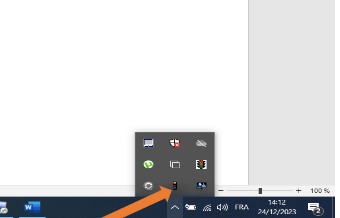

   >Saisissez le Nom d&#39;utilisateur et le Mot de Passe qui ont déjà été fournis par le département informatique.
   
   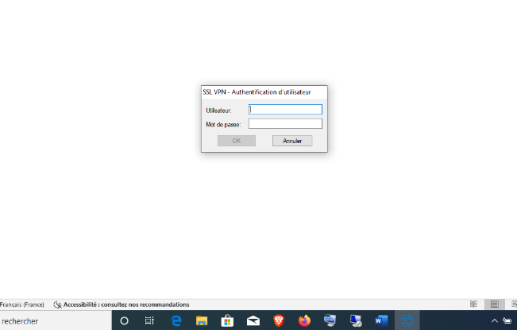

   >Cliquez simplement sur le bouton OK pour vous connecter au VPN.
   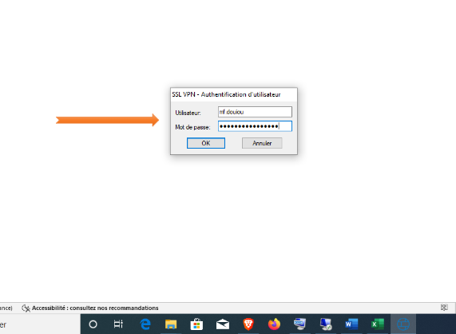

   
   >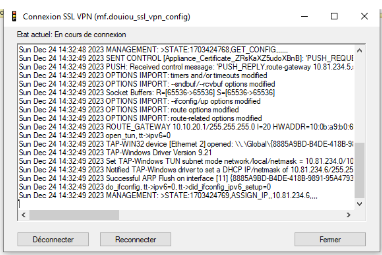
   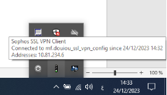

   >Lorsque vous remarquez l&#39;Agent SSL VPN en vert, cela signifie que la connexion est déjà établie.

   

2. **Ouvrez votre navigateur web et accédez à l'URL suivante : [https://10.10.10.13](https://10.10.10.13). Connectez-vous en utilisant votre adresse e-mail et votre mot de passe associés à votre compte ERP Odoo.**

   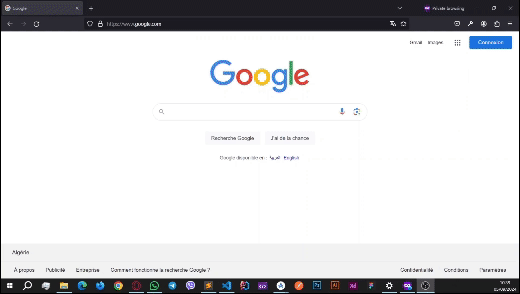

Une fois connecté avec succès, vous pouvez commencer à utiliser les fonctionnalités de l'ERP Odoo spécifiques au profil de magasinier.

## Utilisation de l'ERP Odoo

Dans cette section, nous explorerons différentes fonctionnalités de l'ERP Odoo.

### 1. Réception

#### 1.1. Réception Achat
> Clicker sur **Inventaire** 

> Opérations>Réception Achat

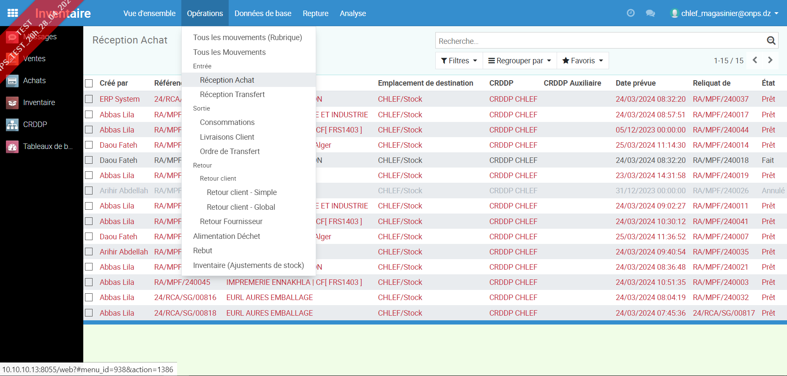

> Clicker un des lignes des réceptions

> Vérifier les quantités et les articles 

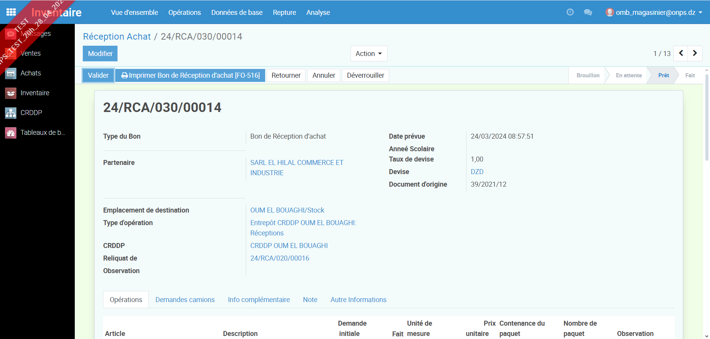

>***Remarque*** 
Ce côté d'interface pour les etats d'opération
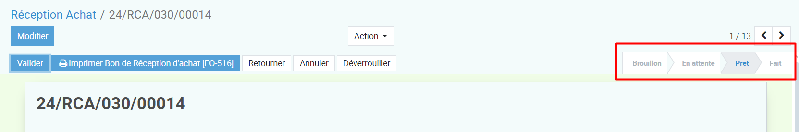

La réception au début est en état 'Prêt' et apres la validation du réception le statu deviendra 'Fait'.

- **Modification de quantité receptioné :**

    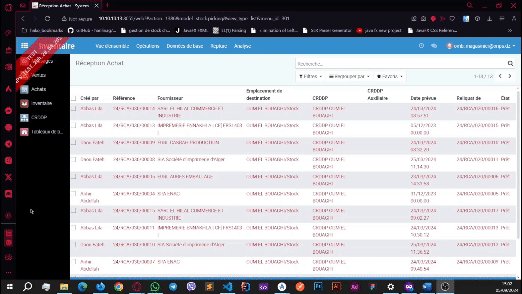

- **Validation :** Clicker sur le boutton ***Valider*** pour validation.

    Après validation vous pouvez créer un reliquat si vous souhaitez recevoir la quantité restante.
    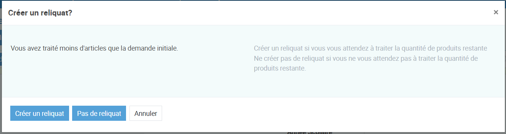

>***Remarque***
Si vous cliquez sur le bouton « Pas de reliquat », le reste de la quantité sera perdu. et tu ne pourras pas y retourner. et le système demandera un « motif ».

#### 1.1. Réception Transfert
> Clicker sur **Inventaire** 

> Opérations>Réception Transfert

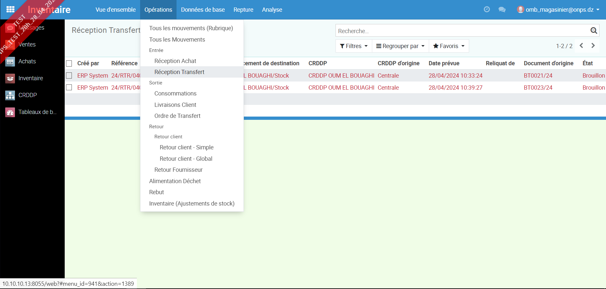

---

Ceci conclut la procédure de connexion à l'ERP Odoo en tant que magasinier. Pour des instructions sur l'utilisation des fonctionnalités spécifiques, veuillez vous référer aux sections suivantes de ce guide.
